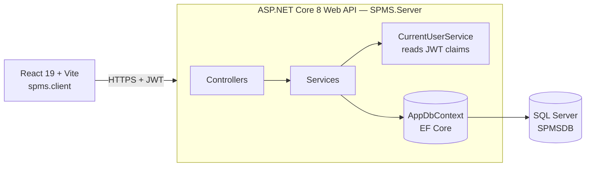
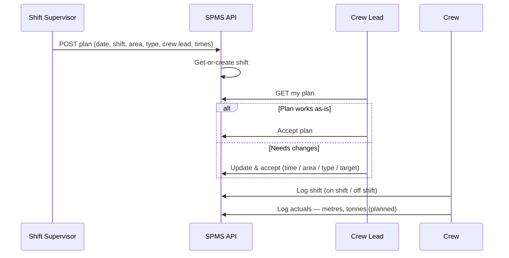
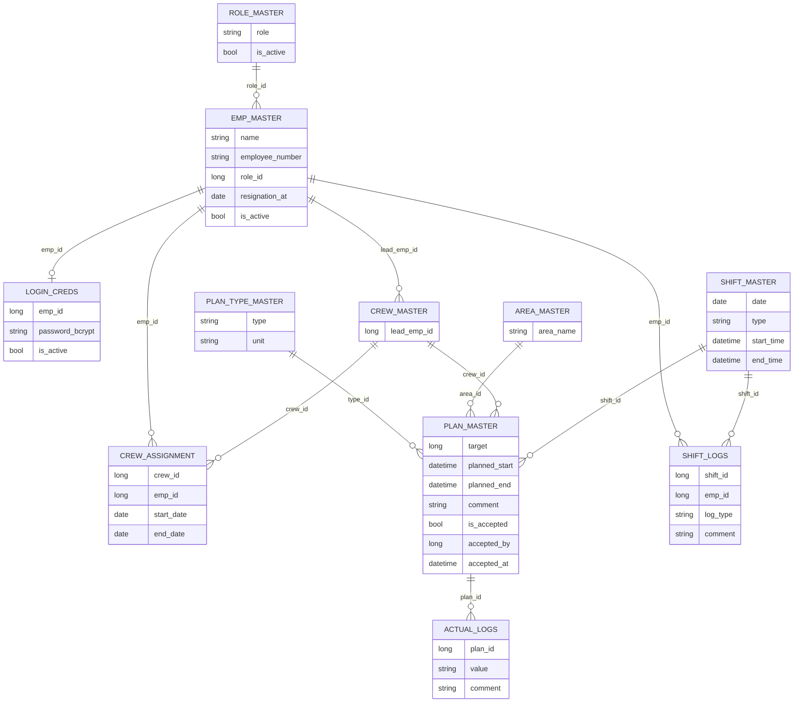

<div align="center">

# ⛏️ Shift Production Management System (SPMS)

**A full-stack showcase project built to demonstrate production-grade patterns in React, ASP.NET Core, and MSSQL** — modeled on a real industry problem: tracking shift production against plan in real time for underground and open-pit mining operations.

</div>

Rather than a generic CRUD demo, this project focuses on the kind of decisions a real ops team actually needs:

- 🔐 **Role-based access with multi-role support**
- 🕓 **Historical (never-overwritten) crew and role assignment tracking**
- 📊 **Live plan-vs-actual variance calculation**
- 🧱 **A JWT-secured API with a properly layered service/DTO architecture**

<div align="center">

**Stack:** React (Vite) · ASP.NET Core Web API · Entity Framework Core · MSSQL · JWT authentication

**Shift Supervisor plans → Crew Lead accepts (or adjusts) → Crew logs actuals → Plan vs. Actual**


</div>

---

## 💡 Why this exists

In underground and open-pit mining, every shift runs on a plan: which crew works which heading, how many metres get drilled, how many tonnes get mucked, when blasting happens. In a lot of operations that plan still lives on a whiteboard in the lineup room, changes happen over the radio, and the real numbers only surface at shift change — too late to recover a bad shift.

SPMS is built around the idea of **short-interval control**: make the plan explicit, make every change accountable, and capture actuals against the plan so supervisors can see variance *during* the shift rather than after it.

| Typical shift today | With SPMS |
|---|---|
| Lineup plan written on a whiteboard or paper sheet | Plans created per **shift, area (level / heading / stope), crew and activity type** with a numeric target and unit (metres, tonnes, holes, buckets…) |
| Crew leads change the plan underground with no record of *why* | Leads **accept** the plan or **update-and-accept** — every change is stamped with who and when |
| Actuals reconstructed from memory at shift change | **Actual logs** captured against each plan for plan-vs-actual variance |
| Paper time sheets for who was on shift | **Shift logs** per employee, tied to the shift |
| Shared logins, no accountability | Per-employee login, **BCrypt-hashed** credentials, **JWT** role claims, full audit trail on every record |

---

## ✨ Features

### ✅ Implemented (API)

- **Employee-number login** — employees sign in with their 3-digit employee number and password; server returns a JWT (8-hour lifetime, matched to a shift length) carrying ID, name and role claims.
- **Employee onboarding** — creating an employee auto-generates a zero-padded employee number (`001`, `002`, …) and a BCrypt-hashed starter password.
- **Shift auto-provisioning** — shifts are resolved by *date + shift type*; if one doesn't exist yet, it's created on the fly when a plan is made.
- **Shift planning** — supervisors create plans linking a shift, crew (via crew lead), area and plan type with planned start/end times.
- **Crew-lead plan inbox** — a logged-in crew lead fetches the plan assigned to their crew.
- **Accept / Update-and-Accept workflow** — leads can accept a plan as-is or adjust time, area, type and target before accepting; both paths record `AcceptedBy` / `AcceptedAt` and update audit fields.
- **Shift logging** — employees log shift events (e.g. clock-in / clock-out) against a shift.
- **Current-user context** — a `CurrentUserService` reads the employee ID from the JWT so every write is attributed automatically (`CreatedBy`, `UpdatedBy`, `AcceptedBy`).
- **Soft deletes + audit trail on every table** via a shared `BaseEntity`.
- **Swagger / OpenAPI** UI in development.

### 🚧 In progress / planned

- [ ] React UI: login, supervisor planning board, crew-lead plan inbox, actuals entry
- [ ] Actual-output logging endpoint (`ActualLog` model is ready)
- [ ] Plan-vs-actual dashboard (per shift, area, crew) with live variance
- [ ] Shift handover notes between outgoing and incoming supervisors
- [ ] Equipment assignment per plan (drills, LHDs, trucks) and delay/downtime codes
- [ ] Multi-role support — employee ↔ role mapping table so one person can hold several roles
- [ ] Role assignment history — effective-dated records instead of overwriting `role_id`
- [ ] Crew management (create crews, assign employees with effective start/end dates — schema already in place via `crew_assignment`)
- [ ] Role-based authorization policies (`[Authorize(Roles = ...)]`) on supervisor-only actions
- [ ] Employee update / deactivate (`UpdateEmployeeDto` is ready)
- [ ] EF Core migrations + seed data (roles, areas, plan types)
- [ ] Unit/integration tests

---

## 🧱 Tech Stack

| Layer | Technology |
|---|---|
| Backend | ASP.NET Core 8 Web API, C# |
| Data access | Entity Framework Core 8 (SQL Server provider) |
| Database | Microsoft SQL Server / SQL Express |
| Auth | JWT Bearer (`Microsoft.AspNetCore.Authentication.JwtBearer`), BCrypt.Net-Next password hashing |
| API docs | Swashbuckle (Swagger UI) |
| Frontend | React 19 + Vite 8 (SPA served through ASP.NET Core SPA Proxy) |
| Tooling | Visual Studio 2022 solution (`.sln` + `.esproj`), ESLint |

---

## 🏗️ Architecture



The backend follows a clean **Controller → Service (interface) → DbContext** layering with DTOs at the boundary, so controllers stay thin and business rules live in testable services.

### Plan lifecycle



---

## 🗄️ Data Model

Every table inherits audit + soft-delete columns from `BaseEntity`:
`id, created_at, created_by, updated_at, updated_by, is_updated, is_deleted, deleted_at, deleted_by`



---

## 🔌 API Reference

All endpoints except login require `Authorization: Bearer <token>`.

| Method | Endpoint | Purpose | Body |
|---|---|---|---|
| `POST` | `/api/Login` | Authenticate, receive JWT | `{ "employeeNumber": "001", "password": "..." }` |
| `POST` | `/api/Employee` | Create employee + login credentials | `{ "name": "Jane Doe", "roleId": 2 }` |
| `POST` | `/api/Plan` | Create a production plan | `PlanDto` |
| `GET` | `/api/Plan` | Get the plan for the logged-in crew lead | — |
| `POST` | `/api/Plan` *(accept)* | Accept a plan | `PlanDto` (id) |
| `POST` | `/api/Plan` *(update & accept)* | Adjust then accept a plan | `PlanDto` |
| `POST` | `/api/Shift` | Log a shift event | `{ "shiftId": 1, "logType": "OnShift" }` |

> ℹ️ The accept and update-and-accept actions are being given dedicated route templates (e.g. `/api/Plan/accept`, `/api/Plan/update-accept`).

<details>
<summary><b>Example — login response</b></summary>

```json
{
  "employeeId": 4,
  "name": "004",
  "role": "CrewLead",
  "token": "eyJhbGciOiJIUzI1NiIsInR5cCI6IkpXVCJ9..."
}
```
</details>

<details>
<summary><b>Example — PlanDto</b></summary>

```json
{
  "date": "2026-09-25",
  "shiftType": "Day",
  "crewLeadId": 4,
  "area": "4200L - Heading 12",
  "planType": "Development Drilling",
  "target": 45,
  "startTime": "2026-09-25T07:00:00",
  "endTime": "2026-09-25T19:00:00",
  "comment": "Bolting crew clears heading by 09:00"
}
```
</details>

---

## 🚀 Getting Started

### Prerequisites

- [.NET 8 SDK](https://dotnet.microsoft.com/download/dotnet/8.0)
- [Node.js 20+](https://nodejs.org/) and npm
- SQL Server or SQL Server Express
- Visual Studio 2022 (recommended) or VS Code

### 1. Clone

```bash
git clone https://github.com/<your-username>/SPMS.git
cd SPMS
```

### 2. Configure the database and JWT

Edit `SPMS.Server/appsettings.Development.json` (or use user-secrets — recommended):

```bash
cd SPMS.Server
dotnet user-secrets init
dotnet user-secrets set "ConnectionStrings:DefaultConnection" "Server=localhost\\SQLEXPRESS;Database=SPMSDB;Trusted_Connection=True;TrustServerCertificate=True;"
dotnet user-secrets set "Jwt:Key" "<a-long-random-secret-at-least-32-chars>"
dotnet user-secrets set "Jwt:Issuer" "ShiftProductionManagementSystem"
dotnet user-secrets set "Jwt:Audience" "ShiftProductionManagementSystem"
```

### 3. Create the database

The schema is database-first (snake_case tables mapped in `AppDbContext`). Create `SPMSDB` and its tables, then seed the lookup tables:

```sql
INSERT INTO role_master (role, is_active, is_deleted) VALUES ('Admin',1,0), ('ShiftSupervisor',1,0), ('CrewLead',1,0), ('Operator',1,0);
INSERT INTO area_master (area_name, is_deleted) VALUES ('4200L - Heading 12',0), ('4400L - Stope 7',0), ('Surface - ROM Pad',0);
INSERT INTO plan_type_master (type, unit, is_deleted) VALUES ('Development Drilling','m',0), ('Mucking','t',0), ('Ground Support - Bolting','bolts',0), ('Haulage','t',0);
```

### 4. Run

**Visual Studio:** open `SPMS.sln`, set multiple startup projects (`SPMS.Server` + `spms.client`) and press **F5**.

**CLI:**

```bash
# terminal 1 — API (Swagger at https://localhost:7201/swagger)
cd SPMS.Server
dotnet run --launch-profile https

# terminal 2 — React client (https://localhost:52589)
cd spms.client
npm install
npm run dev
```

### 5. First login

- New employees get a default password of **`<FirstName><EmployeeNumber>`** — e.g. `Jane` + `007` → `Jane007`.
- A development-only bootstrap admin login (employee number `000`) exists so the first real users can be created. **Remove it before any deployment.**

---

## 📁 Project Structure

```
SPMS/
├── SPMS.sln
├── SPMS.Server/                 # ASP.NET Core 8 Web API
│   ├── Controllers/             # Login, Employee, Plan, Shift
│   ├── Services/                # Business logic behind interfaces
│   │   ├── LoginService.cs      # BCrypt verify + JWT issue
│   │   ├── EmployeeService.cs   # Onboarding + credential generation
│   │   ├── PlanService.cs       # Create / fetch / accept / update plans
│   │   ├── ShiftService.cs      # Get-or-create shift, shift logs
│   │   └── CurrentUserService.cs# Employee ID from JWT claims
│   ├── Models/                  # EF entities (all inherit BaseEntity)
│   ├── DTOs/                    # Request/response contracts
│   ├── Data/AppDbContext.cs     # Table + column mappings
│   └── Program.cs               # DI, JWT auth, Swagger, SPA fallback
└── spms.client/                 # React 19 + Vite frontend
    └── src/
```

---

## 🔐 Security Notes

- Passwords are never stored in plain text — **BCrypt** with per-hash salt.
- JWTs validate issuer, audience, signing key and lifetime.
- Every write records **who** did it via claims, not client-supplied IDs.
- Soft deletes preserve history for audits.
- Keep `Jwt:Key` and connection strings **out of source control** (user-secrets / environment variables).

---

## 🧭 What this project demonstrates

- Domain modelling for **mining operations** — shifts, crews, areas, activity types and plan-vs-actual
- Turning an ambiguous, verbal, radio-and-whiteboard process into **explicit data and workflow rules**
- **Layered .NET architecture** — controllers, service interfaces, DTOs, DI
- **Stateless auth** end-to-end with JWT + BCrypt
- **Auditability by design** — every entity tracks create/update/delete actors and timestamps
- Full-stack delivery with **React + ASP.NET Core** in a single Visual Studio solution

---

## 👤 Author

**Rony Parmar** — Full Stack Developer · Sudbury, Ontario
MSc Computational Science (Laurentian University) · React · Node.js · .NET / C# · SQL Server · MongoDB

📧 ronyparmar2107@gmail.com

---

<div align="center"><sub>Plan the shift. Own the changes. Know the numbers before shift change.</sub></div>
